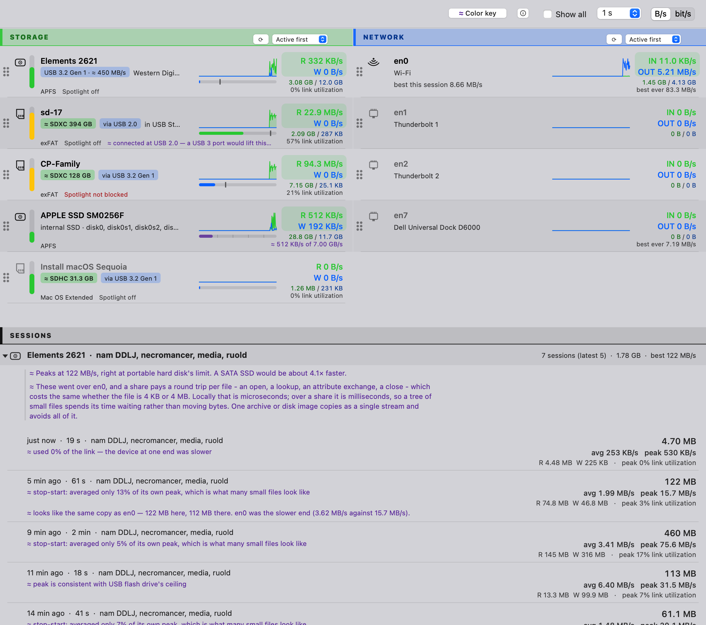

# Chokepoint

**See how fast your drives, cards and network are actually moving data — and what is
holding them back.**

<picture>
  <source media="(prefers-color-scheme: dark)" srcset="docs/chokepoint.png">
  
</picture>

Importing photos off a camera card, backing up to an external drive, pulling a file
from a NAS — Chokepoint shows each device's speed as it happens, keeps a history of
finished copies, and tells you which part of the chain was the limit.

macOS gives you a spinning progress bar and no explanation. This gives you the number,
what it should have been, and the evidence for the difference.

## Questions it answers

**"Why is this card so slow?"**
Often because it is in a USB 2.0 port, and nothing tells you. Chokepoint puts it on the
row: *connected at USB 2.0 — a USB 3 port would lift this ceiling*.

**"Is it stuck, or just slow?"**
Every device shows a live read and write rate and a two-minute chart. A copy that is
crawling looks nothing like one that has stopped.

**"Ten thousand photos took an hour. One 20 GB video took four minutes. Why?"**
A tree of small files pays a fixed cost per file, so the disk spends its time waiting
rather than moving bytes. Chokepoint recognises the shape: *averaged only 13% of its own
peak, which is what many small files look like*.

**"Is my new card reader actually faster?"**
Sessions are filed under the **card**, not the reader — so the same card through the
old reader and the new one land in one history, and the two speeds sit side by side.

**"Something is writing to my card and I am only importing."**
Usually Spotlight, quietly indexing it. Chokepoint flags that in red, and one right-click
stops it for good.

**"Is it the drive, the cable, or the Wi-Fi?"**
Storage and network are on one screen, each measured against what that kind of device
should manage — not against itself.

**"How full is that drive, really?"**
A level beside every device: green, amber past 70%, red past 90%.

## Install

Build it yourself — about ten seconds, and no Xcode needed:

```bash
./build.sh
open build/Chokepoint.app
```

Or [**download the universal build**](https://github.com/cpatil/chokepoint/releases/latest/download/Chokepoint-universal.zip)
for Intel and Apple Silicon. It is not notarised, so macOS will refuse it at first —
which means trusting an unsigned binary from a stranger, for a program that reads your
processes and open files. Building from source is the better path. If you download it
anyway, check it against the checksum in the [release notes](https://github.com/cpatil/chokepoint/releases/latest),
then double-click, let macOS block it, and use **System Settings ▸ Privacy & Security ▸
Open Anyway**.

Runs on macOS 10.14.4 and later.

## Worth knowing

- **Nothing leaves your Mac.** No network access at all. The speed catalogue ships
  inside the app and only updates if you pick the menu item.
- **It needs no permissions to measure anything.** The one optional permission is
  access to removable volumes, and only so it can write the marker that stops Spotlight
  indexing a card.
- **Everything it does can be undone**, from the same place you did it.
- **It says what it measured and what it guessed.** Anything inferred is marked with
  `≈` and coloured, with its reasoning attached, so you can disagree with it.
- Your copy history lives in `~/Library/Application Support/Chokepoint/history.json` —
  device names, byte counts and timestamps, unencrypted. Worth knowing before you share
  diagnostics. Right-click the log to clear it.

## Technical details

How each number is obtained, where it stops being reliable, what the app deliberately
refuses to claim, and how it is built and tested:

**[docs/TECHNICAL.md](docs/TECHNICAL.md)**

MIT — see [LICENSE](LICENSE).
